# gnome-launcher (Shell extension)

A GNOME Shell extension version of the app launcher, replacing the earlier
standalone GTK4 prototype. This exists because **Mutter does not implement
`wlr-layer-shell`** - that prototype's overlay/keyboard-grab behavior could
never work on stock GNOME regardless of code correctness. This extension
uses Shell's own `ModalDialog` instead, which is the actual native
mechanism GNOME provides for this kind of overlay UI.

## Screenshots

All 15 layouts:

| | | |
|---|---|---|
| 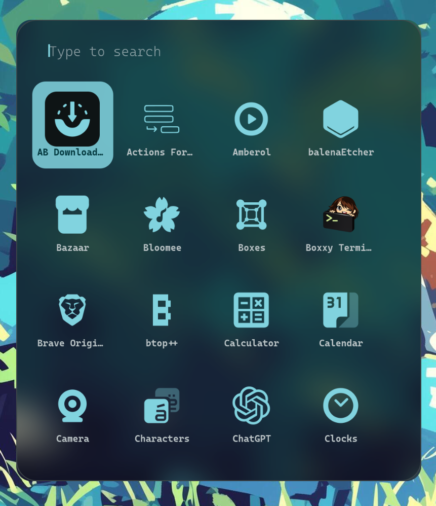<br>`grid` | 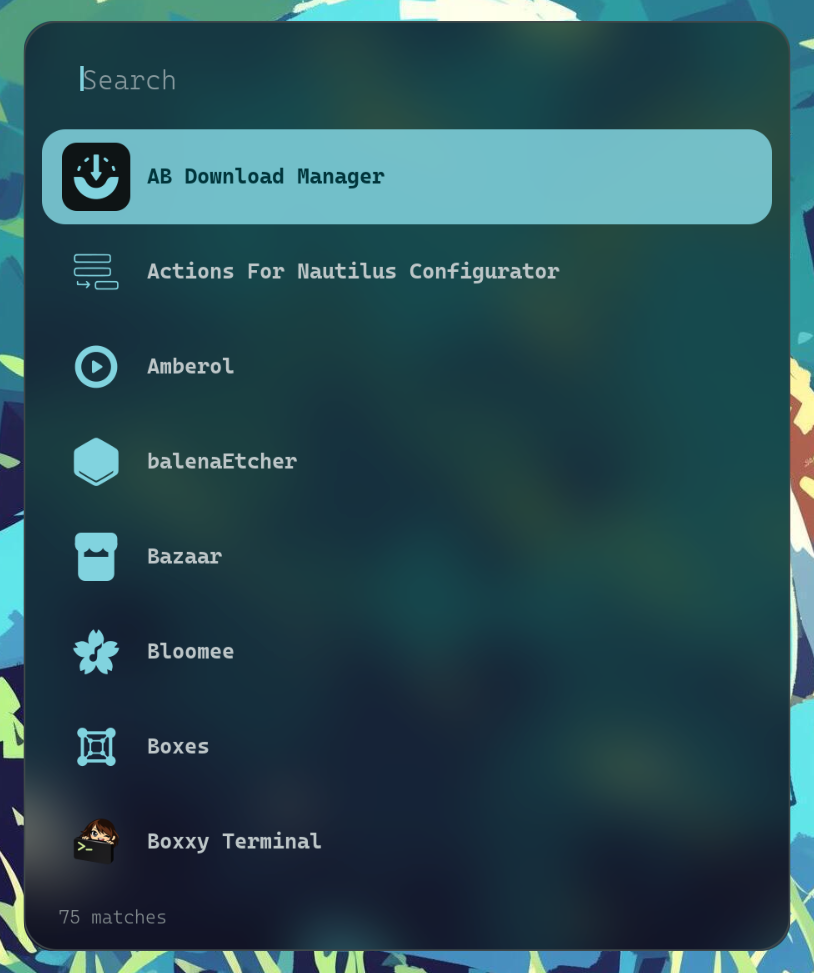<br>`list` | 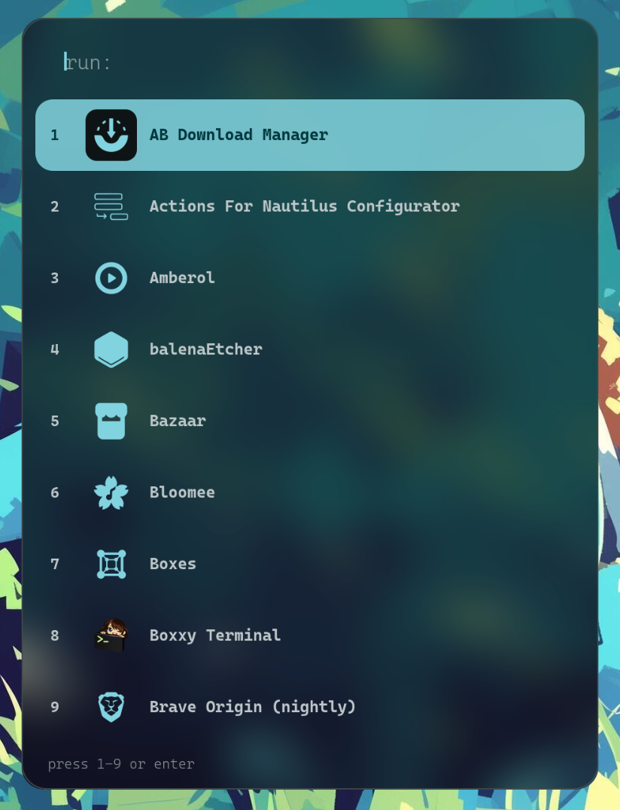<br>`hotkey` |
| 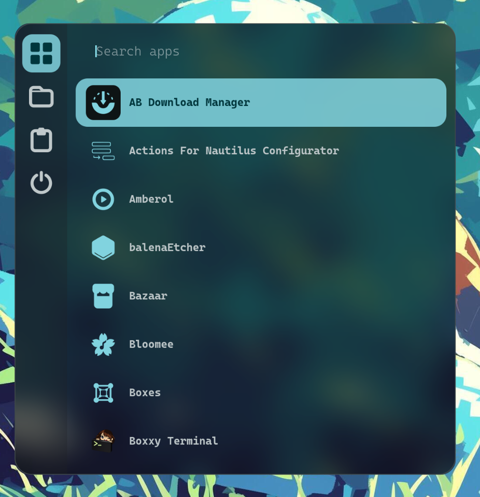<br>`sidebar` | 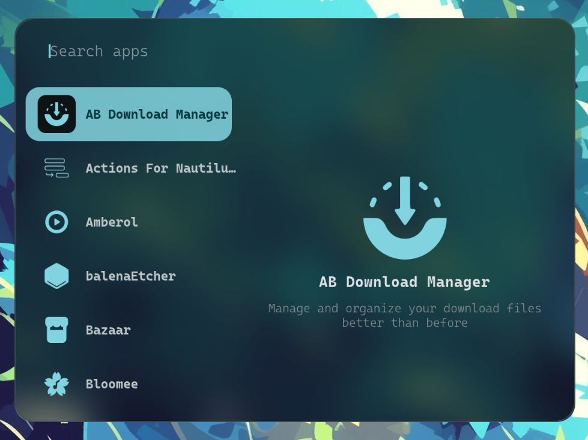<br>`split-preview` | 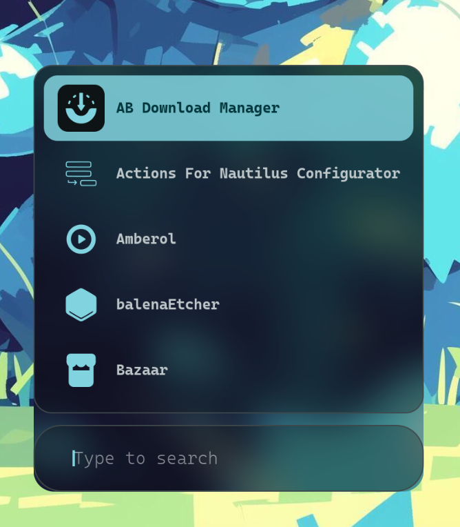<br>`dock` |
| 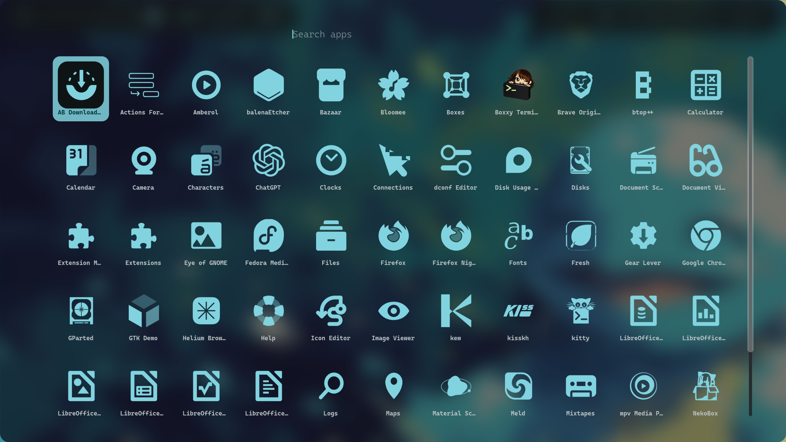<br>`fullscreen` | 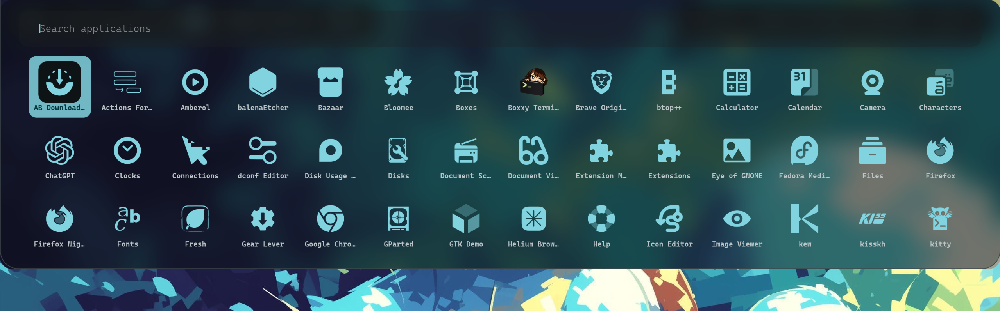<br>`top-dropdown` | 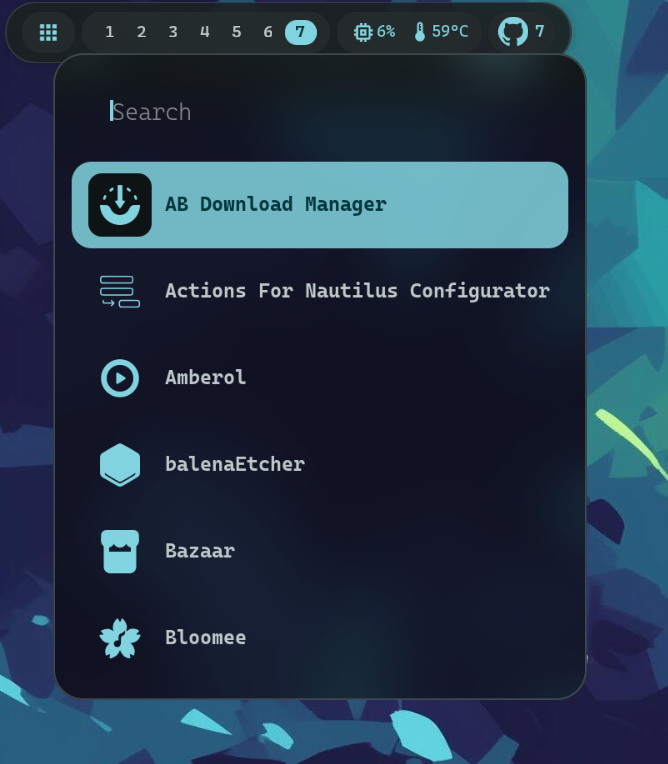<br>`corner` |
| 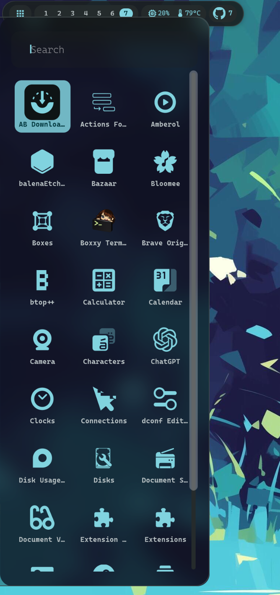<br>`full-edge` | 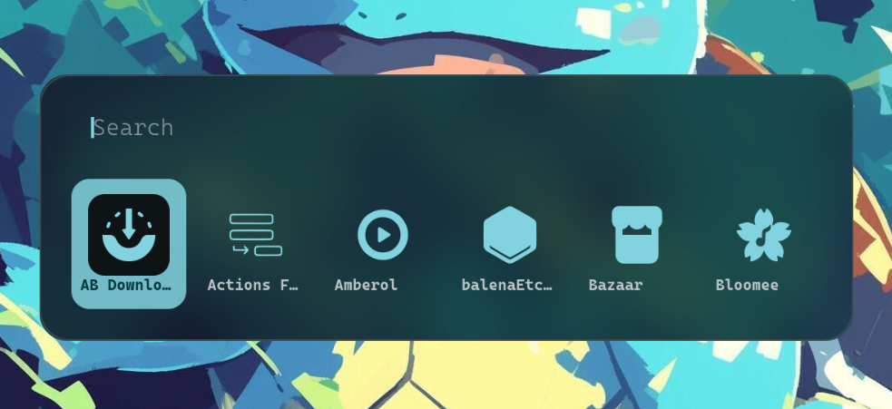<br>`adaptive-width` | 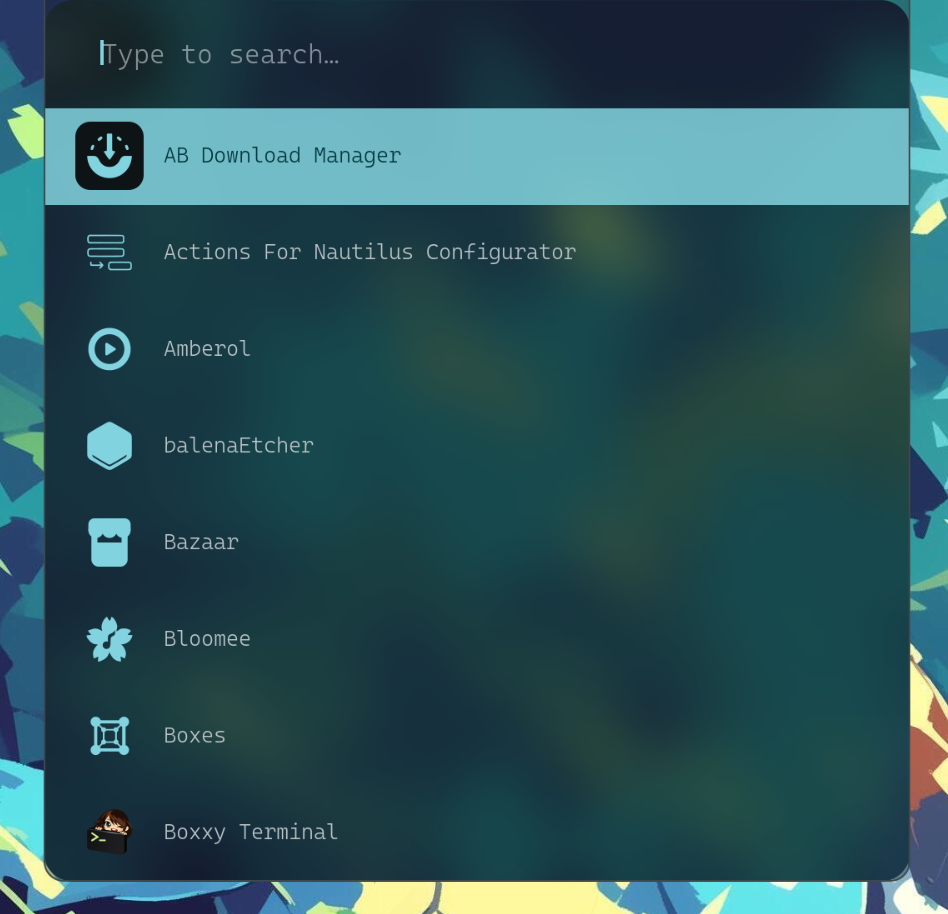<br>`krunner` |
| 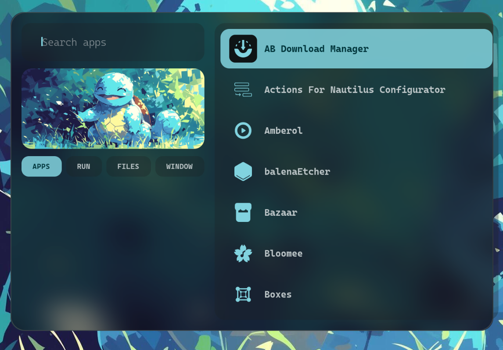<br>`split-tabs` | 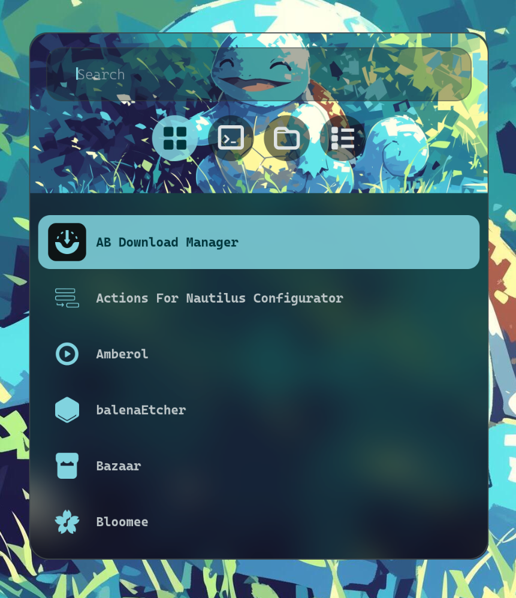<br>`hero-banner` | 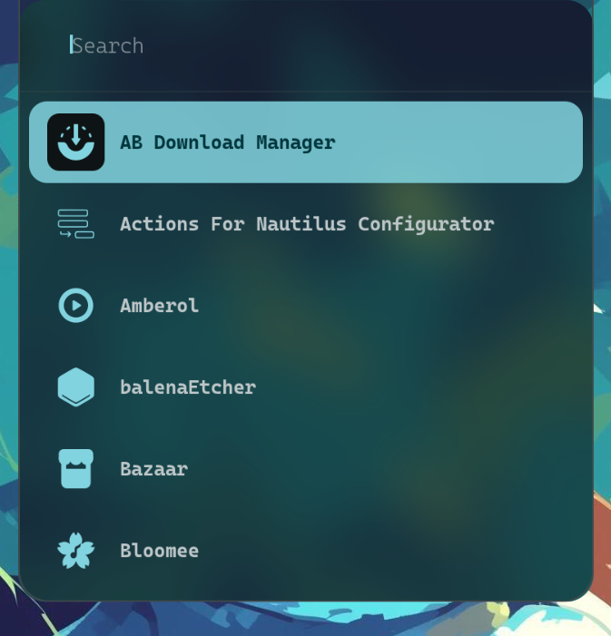<br>`notch` |

## Contents

[Screenshots](#screenshots) · [Features](#features) · [Install](#install) · [Theming](#theming) · [Search](#search) · [Architecture](#architecture) · [License](#license)

## Features

* **15 layouts**: list, grid, dock, fullscreen, top-dropdown, corner,
  sidebar, krunner-style, hero banner, notch, and more — switch via prefs or
  a single `gsettings` call.
* **Fast keyboard workflow**: toggle with `Ctrl+Alt+Space`, type to filter,
  arrows/hotkeys to move, `Enter` to launch, `Escape` to close.
* **Real GNOME search**: uses the same `AppSearchProvider` class as the
  Activities overview (via its async `getInitialResultSet`), with a
  hand-rolled fuzzy matcher as a graceful fallback.
* **Matugen-aware theming**: reads Material 3 color roles from a CSS file at
  open time.
* **Native overlay**: built on Shell's `ModalDialog`, so it works on stock
  GNOME (X11 and Wayland) without relying on `wlr-layer-shell`.

## Install

```bash
# 1. Compile the settings schema
glib-compile-schemas schemas/

# 2. Symlink (not copy) into Shell's extensions directory, using the UUID
#    from metadata.json as the folder name - Shell requires this exact match
mkdir -p ~/.local/share/gnome-shell/extensions
ln -s "$(pwd)" ~/.local/share/gnome-shell/extensions/gnome-launcher@sakib.dev

# 3. Reload Shell so it notices the new extension
#    On Wayland this means logging out and back in - there's no in-session
#    reload command like X11's Alt+F2 r had.
```

After logging back in:

```bash
gnome-extensions enable gnome-launcher@sakib.dev
```

Toggle with **Ctrl+Alt+Space** (the default keybinding - chosen to avoid
colliding with GNOME's own Super+Space input-source switcher). Switch
between all 15 layouts via:

```bash
gnome-extensions prefs gnome-launcher@sakib.dev
```

Or set directly:

```bash
gsettings --schemadir schemas set org.gnome.shell.extensions.gnome-launcher layout "grid"
```

Available layout names: `list`, `grid`, `hotkey`, `sidebar`,
`split-preview`, `dock`, `fullscreen`, `top-dropdown`, `corner`,
`full-edge`, `adaptive-width`, `krunner`, `split-tabs`, `hero-banner`,
`notch`.

### Uninstall

```bash
gnome-extensions disable gnome-launcher@sakib.dev
rm ~/.local/share/gnome-shell/extensions/gnome-launcher@sakib.dev
dconf reset -f /org/gnome/shell/extensions/gnome-launcher/
```

Escape closes the launcher. Enter launches the selected app. Arrow keys
move selection (grid-style layouts jump a full row on Up/Down instead of
one item, via each layout's `columns` property). The hotkey layout also
accepts 1-9 directly.

## Theming

`lib/theme.js` reads Material 3 color roles from a CSS file whose path is
set in preferences (`theme-file-path` GSettings key). The file should
define custom properties such as `--surface: #hex;`, `--primary: #hex;`,
etc.

Configure it via:

```bash
gsettings --schemadir schemas set org.gnome.shell.extensions.gnome-launcher theme-file-path "/path/to/colors.css"
```

Or in **gnome-extensions prefs → Theming → Theme CSS file**.

Leave empty to use the built-in purple M3 fallback. The file is re-read
every time the launcher opens.

Wallpaper for hero-banner / split-tabs is configured the same way
(`wallpaper-path`), defaulting to `~/.config/background.jpg` when empty.

## Search

Two things worth knowing about how search results are produced:

1. **First attempt**: `Shell.AppSystem.initial_search(terms)` - this method
   existed in gnome-shell's source as far back as 2012, but is **confirmed
   not present** on current GNOME (`TypeError: appSystem.initial_search is
   not a function`, verified via journalctl on a real GNOME 50/51 session).
   Reverted.
2. **Current attempt**: importing `AppSearchProvider` directly from
   `resource:///org/gnome/shell/ui/appDisplay.js` - the actual class
   Activities' own search uses, called via its real async
   `getInitialResultSet(terms, cancellable)` method. **Not verified against
   a live Shell session at the time of writing.** Every step (module
   import, class instantiation, the per-query async call) is wrapped in
   try/catch with logging (`journalctl -f -o cat /usr/bin/gnome-shell |
   grep gnome-launcher`), falling back to the hand-rolled fuzzy matcher on
   any failure - so a problem here should degrade gracefully rather than
   break search outright, but that's the intent, not a guarantee.

If this second attempt also turns out not to work, the honest fallback is
the fuzzy matcher already proven reliable - it's not a stopgap, it's a
fully supported code path (`fuzzySearch()` in `appSearch.js`), not
something that needs "finishing" later.

## Architecture

```
extension.js                entry point: registers keybinding, toggles LauncherDialog
lib/
  appSearch.js              Shell.AppSystem enumeration + search (tries
                            GNOME's real AppSearchProvider first, falls
                            back to a fuzzy matcher - see Search below)
  theme.js                  Live Matugen color loader (see Theming above)
  launcherDialog.js         ModalDialog subclass: hosts the active layout,
                            key handling, edge-anchor positioning
  layouts/
    registry.js             maps the 'layout' setting to layout classes
    grid.js                 #1  icon grid
    list.js                 #2  minimal list
    hotkey.js               #3  numbered hotkeys
    sidebar.js              #4  category rail + list
    splitPreview.js         #5  list + detail pane
    dock.js                 #6  bottom-anchored dock
    fullscreen.js           #7  fullscreen takeover
    topDropdown.js          #8  top-edge dropdown shade
    corner.js               #9  corner-anchored panel
    fullEdge.js             #10 full-height edge strip
    adaptiveWidth.js        #11 width follows result count
    krunner.js              #12 dense flush top bar
    splitTabs.js            #13 split panel + mode tabs
    heroBanner.js           #14 gradient banner + mode icons
    notch.js                #15 top-center notch panel
prefs.js                    Adw.PreferencesWindow: layout dropdown
schemas/                    GSettings schema (keybinding + layout selection)
```

All fifteen layouts (14 original archetypes + notch) from `launcher-layout-ideas.md` are now implemented.

### Adding a new layout beyond these 15

1. Create `lib/layouts/<name>.js` exporting a class with:
   - `constructor(dialog, theme)` - stash both, you'll need `theme.<role>`
     hex strings for `style:` properties and `dialog._filtered`/`dialog._selectedIndex`
     for state. Optionally set `this.position` (`'top'`, `'top-flush'`,
     `'bottom'`, `'top-left'`, `'left-edge'`, or `'fullscreen'`) to anchor
     to a screen edge instead of the default centered placement, and/or
     `this.columns` if arrow-key Up/Down should jump a full row.
   - `buildUI()` - returns the root `St.Widget` (typically an `St.BoxLayout`),
     built once when the dialog opens.
   - `renderResults()` - called every time the query or selection changes;
     rebuild the results portion of the tree from `dialog._filtered`.
2. Register it in `lib/layouts/registry.js`'s `LAYOUTS` object.
3. Add its name to `LAYOUT_NAMES` in `prefs.js` so it shows up in the
   preferences dropdown.

## License

GPL-2.0-or-later. See `LICENSE`.
